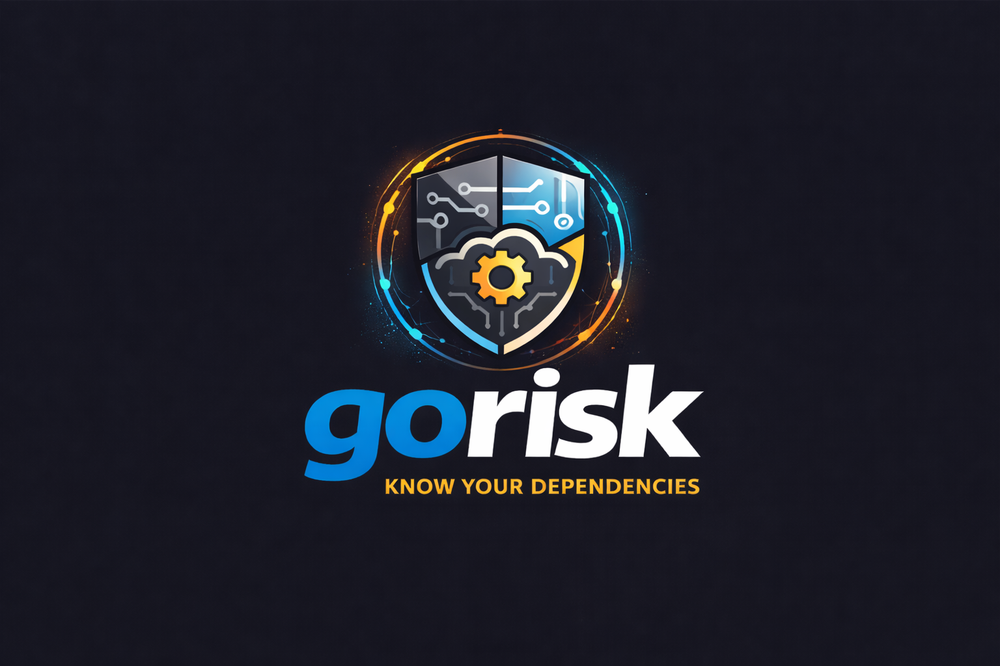

# gorisk



Go dependency risk analyzer. Maps what your dependencies **can do**, not just what CVEs they have.

## Why gorisk

| Tool | CVEs | Capabilities | Upgrade risk | Blast radius | Offline | Free |
|------|------|-------------|--------------|-------------|---------|------|
| govulncheck | ✅ | ❌ | ❌ | ❌ | ✅ | ✅ |
| Snyk | ✅ | ❌ | partial | ❌ | ❌ | SaaS |
| goda | ❌ | ❌ | ❌ | partial | ✅ | ✅ |
| GoSurf | ❌ | ❌ | ❌ | ❌ | ✅ | ✅ |
| **gorisk** | via OSV | **✅** | **✅** | **✅** | **✅** | **✅** |

Key differentiators:

- **Capability detection** — detect which packages can read files, make network calls, spawn processes, or use `unsafe`. Know *what your dependencies can do* before they're in production.
- **Capability diff** — compare two versions of a dependency and detect capability escalation. If `v1.2.3 → v1.3.0` quietly added `exec` or `network`, gorisk flags it as a supply chain risk signal.
- **Blast radius** — simulate removing a module and see exactly which packages and binaries break, plus LOC impact.
- **Upgrade risk** — diff exported symbols between versions to detect breaking API changes before you upgrade.
- **Health scoring** — combines commit activity, release cadence, archived status, and CVE count into a single score.
- **CI-native** — SARIF output compatible with GitHub Code Scanning. Exit codes for policy gating.

## Install

```bash
go install github.com/1homsi/gorisk/cmd/gorisk@latest
```

## Commands

### `gorisk capabilities`

Detect what each package in your module can do.

```bash
gorisk capabilities ./...
gorisk capabilities --min-risk high ./...
gorisk capabilities --json ./...
```

### `gorisk diff` ⚡ unique

Compare capabilities between two versions of a dependency. Detects supply chain risk from capability escalation.

```bash
gorisk diff golang.org/x/net@v0.20.0 golang.org/x/net@v0.25.0
```

Output flags capability additions/removals per package. Exit 1 if escalation detected (exec/network/unsafe/plugin added).

### `gorisk upgrade`

Check for breaking API changes before upgrading a dependency.

```bash
gorisk upgrade golang.org/x/tools@v0.29.0
```

### `gorisk impact`

Simulate removing a module and compute blast radius.

```bash
gorisk impact golang.org/x/tools
gorisk impact --json golang.org/x/tools
```

### `gorisk scan`

Full scan: capabilities + health scoring + CI gate.

```bash
gorisk scan ./...
gorisk scan --sarif ./... > results.sarif
gorisk scan --fail-on medium ./...
gorisk scan --policy policy.json ./...
```

### Policy file

```json
{
  "fail_on": "medium",
  "max_health_score": 40
}
```

## Setup

```bash
git clone https://github.com/1homsi/gorisk
cd gorisk
make setup   # installs git hooks (runs golangci-lint on commit)
make build
make test
```

## Environment

| Variable | Purpose |
|----------|---------|
| `GORISK_GITHUB_TOKEN` | GitHub token for health scoring (higher rate limits) |

## CI integration

```yaml
- name: gorisk scan
  run: gorisk scan --sarif ./... > gorisk.sarif || true

- uses: github/codeql-action/upload-sarif@v3
  with:
    sarif_file: gorisk.sarif
```
